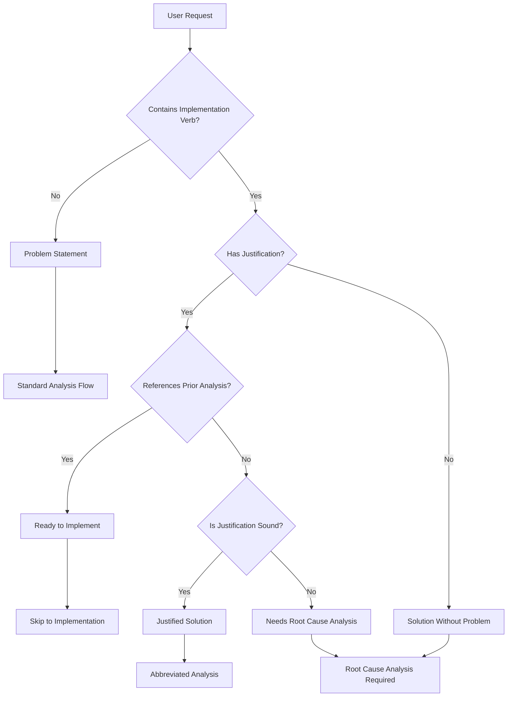

# Blue Hat Problem Assessment Framework

## Overview
This framework enables Blue Hat to intelligently assess whether a problem needs root cause analysis or is ready for implementation, avoiding unnecessary reframing of well-justified solutions.

## STEP 0: Initial Problem Classification (NEW - BEFORE RED HAT)

### Problem Type Classifier
Classify the incoming request into one of these categories:



### Classification Rules

#### 1. Problem Statements (Standard Flow)
**Indicators:**
- "Why is X happening?"
- "Users are experiencing Y"
- "The system fails when Z"
- "We need to understand..."
- "Investigate the cause of..."

**Action:** Proceed with standard 6 Hats analysis

#### 2. Solutions Without Problems (Needs Root Cause)
**Indicators:**
- "Implement X" with no context
- "Add feature Y" without justification
- "We need to build Z" without explaining why
- Technical solution with no business problem

**Action:** Apply root cause analysis BEFORE proceeding

#### 3. Ready to Implement (Skip Reframing)
**Indicators:**
- "Implement the SQL LIMIT solution from issue #123"
- "Based on our analysis, implement X"
- "As discussed, add the rate limiting"
- References specific prior analysis or decision

**Action:** Skip directly to implementation planning

#### 4. Justified Solutions (Abbreviated Analysis)
**Indicators:**
- "Implement X because Y is causing Z"
- Clear problem-solution linkage
- Includes constraints and rationale
- Specifies success criteria

**Action:** Quick validation via Red + Black Hat only

## Root Cause Analysis Protocols

### Protocol A: 5 Whys (For Performance/Technical Issues)
```
Template:
1. Why [stated problem]? → [immediate cause]
2. Why [immediate cause]? → [underlying cause]
3. Why [underlying cause]? → [deeper cause]
4. Why [deeper cause]? → [systemic cause]
5. Why [systemic cause]? → [root cause]

Stop when:
- You reach a cause within our control
- Further "whys" add no value
- The cause is a fundamental constraint
```

### Protocol B: 5W1H Framework (For Business/User Problems)
```
WHO is affected?
├── Direct users
├── Indirect stakeholders
└── System components

WHAT is happening?
├── Observable symptoms
├── Measurable impacts
└── Desired state

WHEN does it occur?
├── Trigger conditions
├── Frequency/patterns
└── Time constraints

WHERE is the issue?
├── Code location
├── System boundary
└── User touchpoint

WHY is it happening?
├── Technical causes
├── Business drivers
└── External factors

HOW should we address it?
├── Minimal intervention
├── Incremental improvement
└── Constraints to respect
```

### Protocol C: First Principles (For Design/Architecture)
```
1. Core Objective
   What are we fundamentally trying to achieve?
   
2. Absolute Constraints
   What cannot be changed or violated?
   
3. Assumed Constraints
   What do we think limits us but might not?
   
4. Simplest Solution
   What's the minimum viable approach?
   
5. Validation
   How do we know it solves the core objective?
```

## Decision Tree for Blue Hat

```python
def assess_problem(request):
    # Step 1: Check for implementation keywords
    impl_keywords = ["implement", "build", "add", "create", "develop"]
    has_impl = any(keyword in request.lower() for keyword in impl_keywords)
    
    if not has_impl:
        return "STANDARD_ANALYSIS"
    
    # Step 2: Check for prior analysis reference
    ref_patterns = ["as discussed", "from issue", "based on analysis", 
                   "we decided", "agreed to", "following our review"]
    has_reference = any(pattern in request.lower() for pattern in ref_patterns)
    
    if has_reference:
        return "SKIP_TO_IMPLEMENTATION"
    
    # Step 3: Check for justification
    just_patterns = ["because", "due to", "in order to", "so that",
                    "to address", "to fix", "to solve"]
    has_justification = any(pattern in request.lower() for pattern in just_patterns)
    
    if not has_justification:
        return "ROOT_CAUSE_ANALYSIS"
    
    # Step 4: Evaluate justification quality
    quality_indicators = [
        "causing",           # Shows causation
        "results in",        # Shows impact
        "prevents",          # Shows blocker
        "users can't",       # Shows user impact
        "system fails",      # Shows failure mode
        "performance",       # Shows metric
        "error",            # Shows failure
        "timeout"           # Shows symptom
    ]
    
    quality_score = sum(1 for ind in quality_indicators if ind in request.lower())
    
    if quality_score >= 2:
        return "ABBREVIATED_ANALYSIS"
    else:
        return "ROOT_CAUSE_ANALYSIS"
```

## Workflow Integration

### Modified Blue Hat Workflow

**NEW STEP 0: Problem Assessment**
```
assessment = assess_problem(user_request)

switch(assessment):
    case "STANDARD_ANALYSIS":
        → Continue to Step 1 (Red Hat consultation)
    
    case "SKIP_TO_IMPLEMENTATION":
        → Jump to Step 5 (Create implementation todos)
        → Note: "Implementing previously analyzed solution from [reference]"
    
    case "ABBREVIATED_ANALYSIS":
        → Red Hat: "Quick gut check on this solution"
        → Black Hat: "Critical risks only"
        → Decision or proceed
    
    case "ROOT_CAUSE_ANALYSIS":
        → Apply appropriate protocol (A/B/C)
        → Reframe problem based on root cause
        → Continue to Step 1
```

### Root Cause Analysis Flow

When ROOT_CAUSE_ANALYSIS is triggered:

1. **Select Protocol**
   - Performance/technical → 5 Whys
   - Business/user impact → 5W1H
   - Design/architecture → First Principles

2. **Execute Analysis**
   ```
   Blue Hat: "This appears to be a solution without a clear problem. 
             Let me apply root cause analysis first."
   
   [Applies selected protocol]
   
   Blue Hat: "Based on root cause analysis:
             - Stated solution: [X]
             - Actual problem: [Y]
             - Root cause: [Z]
             
             Reframing: Instead of '[implement X]', we should 
             '[solve Y by addressing Z]'"
   ```

3. **Proceed with Reframed Problem**
   Continue with standard 6 Hats analysis on the reframed problem

## Examples

### Example 1: Solution Without Problem
**Input:** "Implement a caching layer for the API"

**Assessment:** ROOT_CAUSE_ANALYSIS (no justification)

**5 Whys Applied:**
1. Why cache? → API is slow
2. Why slow? → Database queries take long
3. Why long queries? → Fetching unnecessary data
4. Why unnecessary data? → No query optimization
5. Why no optimization? → Missing indexes and SELECT *

**Reframed:** "Optimize database queries causing API slowness"

### Example 2: Referenced Solution
**Input:** "Implement the SQL LIMIT solution we discussed in issue #127"

**Assessment:** SKIP_TO_IMPLEMENTATION

**Action:** Create implementation todos directly, no reframing needed

### Example 3: Justified Solution
**Input:** "Implement rate limiting because we're exceeding the 48k daily API limit causing service disruptions"

**Assessment:** ABBREVIATED_ANALYSIS

**Action:** Quick Red + Black validation only, then proceed

### Example 4: Problem Statement
**Input:** "Users are experiencing timeouts when uploading large files"

**Assessment:** STANDARD_ANALYSIS

**Action:** Full 6 Hats analysis flow

## Anti-Patterns to Avoid

### ❌ Over-Analysis
Don't apply root cause analysis to:
- Emergency fixes with clear causes
- Previously analyzed solutions
- Regulatory compliance requirements
- Security patches

### ❌ Under-Analysis  
Don't skip analysis for:
- Vague feature requests
- Solutions looking for problems
- "Nice to have" additions
- Technical debt without impact

### ❌ Analysis Paralysis
Stop analysis when:
- Root cause is external (vendor API limit)
- Further analysis adds no value
- Constraint is fundamental (physics, regulations)
- Solution is obvious and low-risk

## Success Metrics

Blue Hat should track:
1. **Classification Accuracy**: Did we choose the right path?
2. **Reframing Value**: Did root cause analysis change the solution?
3. **Time Saved**: How many unnecessary analyses were skipped?
4. **Problem Prevention**: How many solution-first approaches were corrected?

## Integration with Red Hat

After classification, Red Hat consultation becomes more targeted:

- **Standard Analysis**: "How complex does this problem feel?"
- **Root Cause Found**: "Does this root cause feel right?"
- **Abbreviated Check**: "Quick gut check - any red flags?"
- **Skip Implementation**: Not needed, proceed directly

This framework ensures Blue Hat adds value through intelligent assessment while avoiding bureaucratic overhead on well-defined tasks.